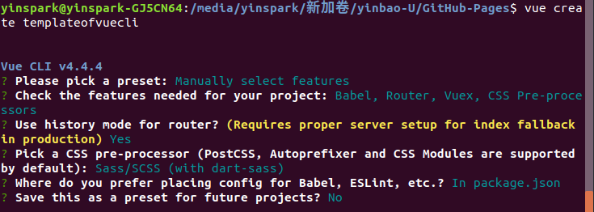

# 构建 Vue-CLI4 项目模板

构建 Vue 最基础脚本架, 并通过手动更新和自动更新在 GitHub Pages 上

## 一. 创建最基础 Vue-CLI4 项目

安装
`cnpm install -g @vue/cli`
`vue --version`

创建项目
`vue create templateofvuecli4`



运行
`cd templateofvuecli4`
`npm run serve`
`npm run build`

## 二. push 到 GitHub 远程仓库(开启 GitHub Pages)

```
git remote
git remote add origin git@github.com:yinSpark/templateofvuecli4.git
git push -u origin master
```

## 三. 手动更新展示模板

1. 创建 `vue.config.js`
<https://github.com/yinSpark/templateofvuecli4/blob/master/vue.config.js>

2. 创建 `deploy.sh`
   <https://github.com/yinSpark/templateofvuecli4/blob/master/deploy.sh>

3. 运行命令
`bash deploy.sh`

4. 查看
<http://www.yinspark.xyz/templateofvuecli4/>

5. Push 到远程仓库

```
git status
git add .
git commit -m ""
git push origin master
```

## 四. 自动更新展示模板

1. 创建 `vue.config.js`
<https://github.com/yinSpark/templateofvuecli4/blob/master/vue.config.js>

2. 安装 Travis CLI 客户端：`gem install travis && travis --login`
这一步需要首先登录 Travis 官方网站, 授权 GitHub 的权限。然后执行安装命令。

3. 创建 `.travis.yml`
<https://github.com/yinSpark/templateofvuecli4/blob/master/.travis.yml>

4. Push 到远程仓库

```
git status
git .
git commit -m ""
git push origin master
```

5. 执行构建命令即会自动更新到 GitHub Pages 上
分支 gh-pages：就是 GitHub Pages 使用的仓库
可能需要安装 `gh-pages`
`npm install gh-pages --save-dev`

6. 查看
<http://www.yinspark.xyz/templateofvuecli4/>
